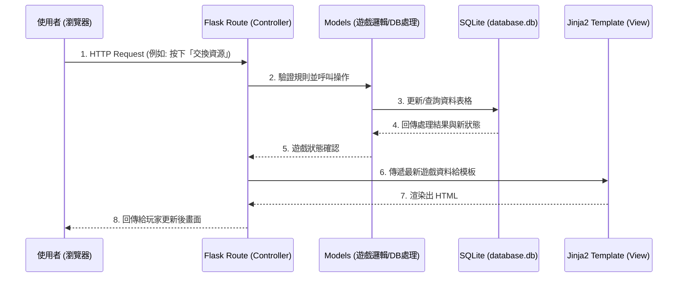

# 線上桌遊系統 Architecture 系統架構文件

本文件依據 [產品需求文件 (PRD)](PRD.md) 的需求，規劃「線上桌遊系統」的系統架構、技術選型、資料夾結構與關鍵設計決策。

---

## 1. 技術架構說明

為了快速驗證產品想法並兼顧開發效率，我們採用輕量級但功能齊全的技術組合：

- **後端框架：Python + Flask**
  - **原因**：Flask 是輕量級框架，能夠快速搭建路由（Routes）與 API 介面。比起龐大的框架，Flask 給予極大的彈性，非常適合用來實作小型的線上桌遊 MVP。
- **視圖（前端渲染）：Jinja2 模板引擎**
  - **原因**：為了簡化架構，初期我們不採用前後端分離（如 React/Vue）。Jinja2 是 Flask 內建的模板引擎，能直接把後端資料渲染到 HTML 頁面中送出給瀏覽器，不僅降低開發初期複雜度，也有利於快速刻畫畫面。
- **資料庫：SQLite**
  - **原因**：檔案型資料庫，完全無需配置獨立的資料庫伺服器（如 MySQL/PostgreSQL）。對於一個開發階段或初期上線的專案來說，能夠輕鬆管理資料庫檔案並滿足多人房、發牌、資源交換等基本狀態儲存。

### 系統設計模式：MVC 概念實作
本專案的架構精神採用類似 MVC（Model-View-Controller）的分層模式：
- **Model (資料模型)**：負責與 SQLite 溝通，定義「用戶、房間、卡牌、資源、遊戲紀錄」的結構，並封裝資料庫的讀寫邏輯。
- **View (視圖)**：負責將資料呈現給使用者，這裡是 Jinja2 模板，負責把變數呈現在 HTML 介面上。
- **Controller (控制器)**：在 Flask 中即為**路由 (Routes)**，負責接收玩家的請求（例如：發牌按鈕按下）、呼叫 Model 去修改狀態，最後將更新後的資料丟給 Jinja2 (View) 渲染出新畫面。

---

## 2. 專案資料夾結構

整個專案將按照功能分層存放，確保程式碼有條理、更容易維護。

```text
web_app_development/
├── app/                      # 應用程式主目錄
│   ├── models/               # 資料庫模型邏輯 (Models)
│   │   ├── __init__.py
│   │   ├── user.py           # 用戶資料相關邏輯
│   │   ├── room.py           # 房間與遊戲狀態、回合相關邏輯
│   │   └── game.py           # 資源、牌組、交易等遊戲核心邏輯
│   ├── routes/               # Flask 路由控制器 (Controllers)
│   │   ├── __init__.py
│   │   ├── auth_routes.py    # 註冊、登入與身份驗證路由
│   │   ├── room_routes.py    # 創建房間、加入房間路由
│   │   └── game_routes.py    # 發牌、回合操作、資源交換、對話路由
│   ├── templates/            # Jinja2 網頁模板 (Views)
│   │   ├── base.html         # 共用的版型佈局 (包含 Navbar、基本樣式)
│   │   ├── index.html        # 首頁 / 登入頁
│   │   ├── lobby.html        # 遊戲大廳 (建立與加入房間)
│   │   └── board.html        # 主要遊戲面板 (卡牌、資源、對話紀錄)
│   └── static/               # 前端靜態資源 (CSS, JS, 圖片)
│       ├── css/
│       │   └── style.css     # 主樣式表
│       ├── js/
│       │   └── game.js       # 處理部分前端互動的 AJAX/Polling 腳本
│       └── img/              # 桌遊卡牌圖示、UI 素材
│
├── instance/                 # Flask 儲存執行期相關檔案的目錄
│   └── database.db           # SQLite 資料庫主檔 (不應進入版本控制)
│
├── docs/                     # 專案說明文件
│   ├── PRD.md                # 產品需求文件
│   └── ARCHITECTURE.md       # 系統架構文件 (本檔案)
│
├── requirements.txt          # Python 依賴套件清單 (例如: Flask)
└── app.py                    # 專案啟動入口，負責初始化 Flask App 與註冊 Blueprint
```

---

## 3. 元件關係圖

以下呈現瀏覽器、Flask、SQLite 與 Jinja2 之間的互動流程：



---

## 4. 關鍵設計決策

以下是在這個「線上桌遊系統」架設時所做的重要技術取捨與考量：

1. **Jinja2 + 前端 Polling (輪詢) 同步最新狀態**
   - **問題**：桌遊需要讓其他玩家在不重整頁面的狀況下看到你的動作。
   - **決策**：身為輕量級架構，初期我們不使用複雜的 WebSockets。考量到回合制桌遊的時間寬容度，可以運用簡單的 JavaScript `setInterval()` 每隔幾秒去問 Flask 後端「房間有沒有更新？/ 對話框有沒有新訊息？」，以最低成本達到畫面同步。

2. **所有核心規則放在後端 (Model) 驗證**
   - **問題**：玩家透過修改網頁原始碼作弊怎麼辦？
   - **決策**：在 `app/models/` 當中嚴格執行所有判斷邏輯。例如換牌時，前端傳來的「扣除 1 木頭」必須在後端實際到資料庫查核該玩家木頭數量是否足夠，若足夠才能進行下一輪操作。不會把不該被看見的暗牌（未抽取的牌）送到前端，從根源確保安全性與防作弊。

3. **使用 Blueprint 分割路由配置**
   - **問題**：如果所有功能（登入、房間、遊戲）都擠在 `app.py`，檔案將變得無比臃腫。
   - **決策**：透過 Flask Blueprint 機制，將路由分拆至 `auth_routes.py`、`room_routes.py`、`game_routes.py` 三個專屬模組，提升團隊協作效率及程式可讀性。

4. **採用關係型資料庫應付遊戲狀態管理**
   - **問題**：遊戲會有大量的「玩家狀態」、「場上卡牌」、「手牌」、「資源數量」等結構性資料。
   - **決策**：SQLite 的關係型設計非常適合用來儲存這種有關聯的資料。例如建立「Room」關聯到多個「User」，「User」再關聯到自己擁有的「Resource」或「Card」，藉由 Foreign Key 確保資料關聯性清晰。
