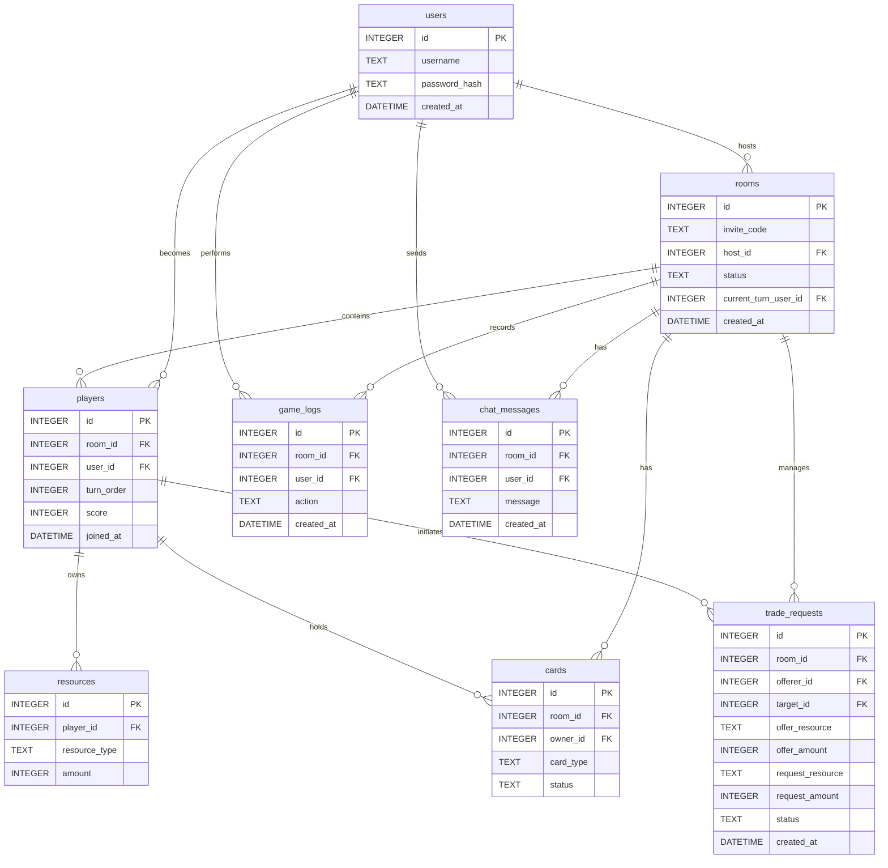

# 資料庫設計文件 (DB Design)

本文件依據 PRD 與 FLOWCHART 產出，記錄「線上桌遊系統」的 SQLite 資料庫設計，包含實體關係圖 (ERER Diagram)、資料表說明與 SQL 語法。

## 1. ER 圖（實體關係圖）

## 2. 資料表詳細說明

### `users` 用戶表
管理玩家帳號密碼。
- `id`: INTEGER PRIMARY KEY AUTOINCREMENT。使用者唯一識別碼。
- `username`: TEXT。玩家登入帳號，必填且唯一。
- `password_hash`: TEXT。雜湊後的密碼，防止明文外洩，必填。
- `created_at`: DATETIME。帳號建立時間。

### `rooms` 遊戲房間表
管理遊戲大廳、狀態及目前回合誰在動作。
- `id`: INTEGER PRIMARY KEY AUTOINCREMENT。房間唯一識別碼。
- `invite_code`: TEXT。房主建立後給其他玩家加入用的邀請碼（如 6 碼英數），必填且唯一。
- `host_id`: INTEGER。關聯至 `users(id)`，標示房主。
- `status`: TEXT。房間狀態（`waiting`, `playing`, `finished`）。
- `current_turn_user_id`: INTEGER。關聯至 `users(id)`，標示目前回合是誰。
- `created_at`: DATETIME。房間建立時間。

### `players` 玩家（房間內的參與者）表
記錄哪個玩家加入哪間房間，以及在該遊戲裡的基本狀態（得分、順位）。
- `id`: INTEGER PRIMARY KEY AUTOINCREMENT。遊戲玩家身份唯一識別碼。
- `room_id`: INTEGER。關聯至 `rooms(id)`。
- `user_id`: INTEGER。關聯至 `users(id)`。
- `turn_order`: INTEGER。玩家在遊戲中輪替順位（例如 1, 2, 3）。
- `score`: INTEGER。目前得分，預設 0。
- `joined_at`: DATETIME。玩家加入的時間。

### `resources` 資源表
針對該局遊戲，記錄某個玩家擁有各種資源（如木頭、羊、磚塊）的數量。
- `id`: INTEGER PRIMARY KEY AUTOINCREMENT。
- `player_id`: INTEGER。關聯至 `players(id)`。
- `resource_type`: TEXT。資源類型名稱（例如 "wood", "brick", "sheep"）。
- `amount`: INTEGER。資源持有數量。

### `cards` 卡牌表
記錄整個房間生成的牌庫與每張卡牌當前的歸屬。
- `id`: INTEGER PRIMARY KEY AUTOINCREMENT。
- `room_id`: INTEGER。關聯至 `rooms(id)`。標示這張卡屬於哪個房間。
- `owner_id`: INTEGER。關聯至 `players(id)`。標示這張卡在誰手上，若尚在牌庫則為 NULL。
- `card_type`: TEXT。卡牌名稱（例如 "knight", "victory_point"）。
- `status`: TEXT。紀錄卡牌目前狀態，例如 `deck` (牌庫)、`hand` (手牌)、`played` (已打出)。

### `game_logs` 遊戲歷史紀錄表
紀錄每一個玩家的操作行為，供使用者查看。
- `id`: INTEGER PRIMARY KEY AUTOINCREMENT。
- `room_id`: INTEGER。關聯至 `rooms(id)`。
- `user_id`: INTEGER。關聯至 `users(id)` 操作者。若為系統動作可存 NULL。
- `action`: TEXT。操作描述（如 "打出了一張騎士卡", "消耗 1 木頭 1 磚塊建造道路"）。
- `created_at`: DATETIME。操作時間。

### `chat_messages` 對話訊息表
記錄玩家在大廳或遊戲板裡的對話訊息。
- `id`: INTEGER PRIMARY KEY AUTOINCREMENT。
- `room_id`: INTEGER。關聯至 `rooms(id)`。
- `user_id`: INTEGER。關聯至 `users(id)`。
- `message`: TEXT。訊息內容。
- `created_at`: DATETIME。發送時間。

### `trade_requests` 交易請求表
記錄玩家之間發起的資源交換請求。
- `id`: INTEGER PRIMARY KEY AUTOINCREMENT。
- `room_id`: INTEGER。關聯至 `rooms(id)`。
- `offerer_id`: INTEGER。關聯至 `players(id)`，發起交易者。
- `target_id`: INTEGER。關聯至 `players(id)`，交易對象（若公開交易則可為 NULL）。
- `offer_resource`: TEXT。提供的資源類型（如 "wood"）。
- `offer_amount`: INTEGER。提供的數量。
- `request_resource`: TEXT。要求的資源類型（如 "brick"）。
- `request_amount`: INTEGER。要求的數量。
- `status`: TEXT。狀態（`pending`, `accepted`, `rejected`, `canceled`）。
- `created_at`: DATETIME。發起時間。

## 3. SQL 建表語法

詳見 `database/schema.sql` 檔案。
