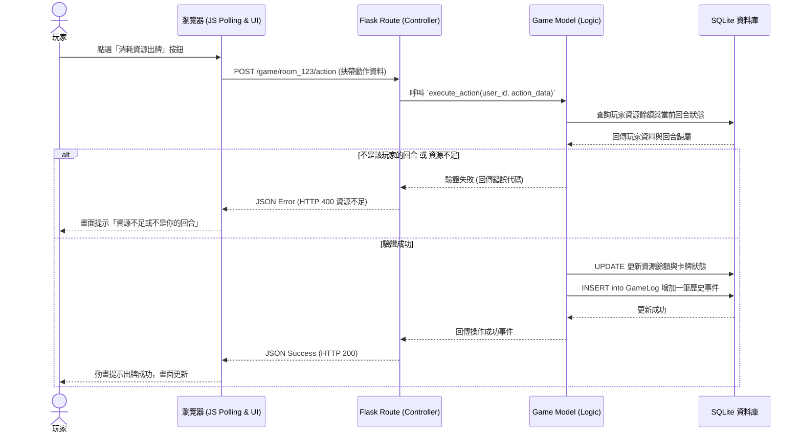

# 線上桌遊系統 FLOWCHART 流程圖

本文件依據 [產品需求文件 (PRD)](PRD.md) 與 [系統架構文件 (ARCHITECTURE)](ARCHITECTURE.md)，為線上桌遊系統設計使用者操作流程與核心系統互動的資料流。

---

## 1. 使用者流程圖（User Flow）

描述玩家從進入網站開始，建立/加入房間，進入遊戲並執行相關回合操作的核心路徑。

```mermaid
flowchart LR
    A([玩家開心開啟網站]) --> B{是否已登入？}
    B -->|否| C[登入/註冊頁面]
    C --> D[驗證身份]
    D -->|成功| E[遊戲大廳 Lobby]
    B -->|是| E
    
    E --> F{選擇房間操作}
    F -->|建立房間| G[取得邀請碼並進入準備區]
    F -->|輸入邀請碼| H[加入朋友的房間準備區]
    
    G --> I{房主點擊開始遊戲}
    H --> I
    
    I --> J[進入遊戲主要面板 Board]
    J --> K{輪到我的回合了嗎？}
    
    K -->|否| L[看著別人玩 / 發送文字訊息]
    L --> K
    
    K -->|是| M{選擇操作動作}
    M --> N[抽牌/發牌]
    M --> O[發起資源交換請求]
    M --> P[策略佈局 (出牌/消耗資源)]
    
    N --> Q[結束回合]
    O --> Q
    P --> Q
    
    Q --> R[輪到下一位玩家]
    R --> K
```

---

## 2. 系統序列圖（Sequence Diagram）

以下序列圖描述了玩家在遊戲中**點擊並確認一項回合操作（例如：消耗資源來出牌或發起資源交換）**，到資料庫檢查與更新最新狀態的完整流程。



---

## 3. 功能清單對照表

對應整個應用程式的畫面與操作，我們規劃以下路由及對應方法。

| 功能名稱 | URL 路徑 | HTTP 方法 | 描述 |
| :--- | :--- | :--- | :--- |
| **首頁 / 登入頁** | `/` | GET | 渲染系統首頁與登入介面 |
| **用戶註冊** | `/auth/register` | POST | 接收表單並建立新用戶帳號 |
| **用戶登入** | `/auth/login` | POST | 驗證密碼建立 Session |
| **登出** | `/auth/logout` | GET / POST | 清除玩家的登入 Session |
| **遊戲大廳** | `/lobby` | GET | 查看目前個人狀態，渲染加入/建立房間的介面 |
| **建立房間** | `/room/create` | POST | 在資料庫建立一筆新房間資料，回傳邀請碼 |
| **加入房間** | `/room/join` | POST | 驗證邀請碼，將玩家加入該房間 |
| **遊戲主頁面** | `/game/<room_id>` | GET | 渲染 Jinja2 的桌遊面板佈局 |
| **獲取遊戲狀態** | `/game/<room_id>/state`| GET | (Polling) 取得最新的遊戲回合、資源、對話與Log狀態 |
| **玩家行動** | `/game/<room_id>/action`| POST | 執行核心遊戲動作 (如：抽牌、打卡、資源升級) |
| **資源交換** | `/game/<room_id>/trade` | POST | 發起與其他玩家的資源交易請求 |
| **發送訊息** | `/game/<room_id>/chat` | POST | 在遊戲對話框內發言 |
| **結束回合** | `/game/<room_id>/end` | POST | 將回合交接給下一位輪替順位的玩家 |
